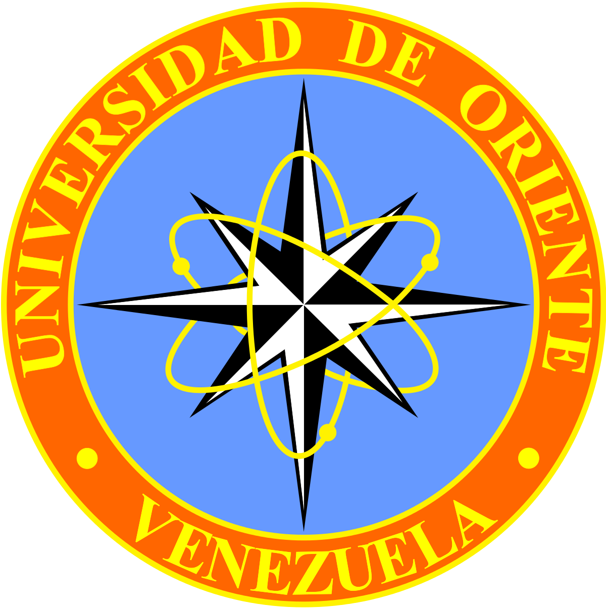

# MacedoniaSL 

> MacedoniaSL es un proyecto con la premisa de Software Libre, con el cual los estudiantes se puedan inspirar a crear diferentes Software para la automatización de procesos de ingeniería. El mismo fue mi proyecto de investigación para optar por el título de Ingeniero de Petróleo en la Universidad de Oriente, Venezuela.

Es un programa creado bajo software libre empleado para el diseño de sistemas de levantamiento artificial por gas "Gas Lift" en sus dos modalidades, continuo o intermitente para pozos de petróleo. Este software fue creado debido a que se conoce que los altos costos las licencias de los programas que existen en el mercado para uso corporativo y educacional privan a los usuarios del uso de herramientas de este tipo. Por esa razón se decidió desarrollar este programa para cubrir la necesidad en la que se encuentran los usuarios que deseen poder diseñar un sistema LAG tanto por motivos laborales como también por motivos académicos. Los usuarios podrán estimar el diseño en un corto periodo de tiempo bajo el uso de este software obteniendo resultados gráficos y tabulados para ambos métodos.

Las posibles variables calculadas para el método continuo son: profundidad de las válvulas, presión dinámica en la tubería de producción a la profundidad de la válvula, presión de inyección a la profundidad de la válvula, caudal de líquido de producción por día, corte de agua, caudal de gas inyectado y temperatura las válvulas

Las posibles variables calculadas para el método intermitente son: profundidad de las válvulas, presión dinámica en la tubería de producción a la profundidad de la válvula, presión de inyección a la profundidad de la válvula, temperatura de las válvulas, presión de tapón inicial, eficiencia de levantamiento, volumen real de líquido producido por ciclo, número máximo de ciclos por día, tasa máxima por día y gas requerido para levantar el tapón de líquido por ciclo

Sistema de levantamiento artificial por gas
El Levantamiento Artificial por Gas es uno de los métodos más utilizados a nivel mundial para la optimización de pozos petroleros. Conceptualmente es muy sencillo ya que su funcionamiento se basa en la inyección de gas comprimido por el anular ubicado entre la tubería de producción y el revestidor. El gas disminuye el peso de la columna de tal forma que la energía del yacimiento resultará suficiente para levantar la producción hasta la superficie. Es necesario inyectar el gas lo más profundo posible para reducir sustancialmente el peso de la columna e inyectar la tasa de gas adecuada para que la fricción de la corriente multifásica no anule la reducción de peso.

Método Continuo
En este tipo de levantamiento artificial se inyecta una tasa diaria de gas de forma continua lo más profundo posible en la columna de fluido a través de una válvula ubicada en el anular tubing-casing, con el propósito de disminuir la presión fluyente en el fondo del pozo, aumentando el diferencial de presión a través del área de drenaje para que la formación productora aumente la tasa de producción que entrega al pozo.

Método Intermitente
El LAG intermitente consiste en inyectar cíclica e instantáneamente un alto volumen de gas comprimido en la tubería de producción con el propósito de desplazar, hasta la superficie, el tapón de líquido que aporta el yacimiento por encima del punto de inyección. Una vez levantado dicho tapón cesa la inyección para permitir la creación de un nuevo tapón de líquido debido a la reducción de la presión en el fondo del pozo para luego repetirse el ciclo de inyección.

Limitaciones del Programa
* Uso bajo el sistema de unidades inglés
* Funcionamiento unicamente para pozos verticales.
* Número máximo de válvulas: 10.
* Fabricantes de válvulas para el diseño "Camco".
* Se considera una velocidad de creación del tapón de líquido de 1000pies/min.
* Se consideran ciclos de 3min por cada 1000 pies de levantamiento.
